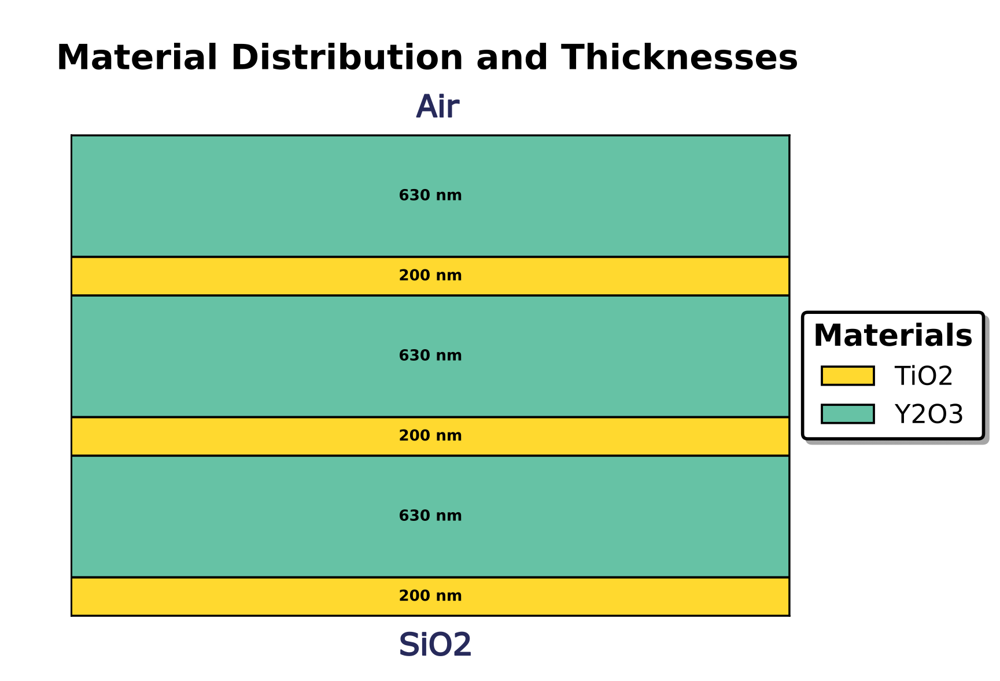
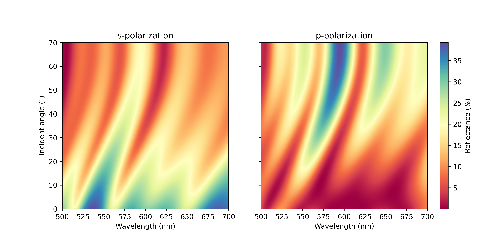
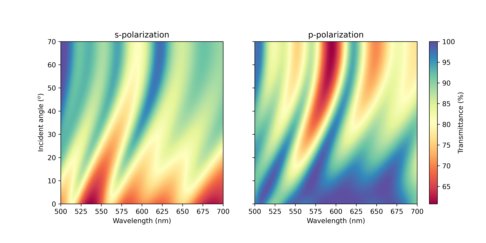

.. role:: tmmgreen

Quickstart
==================

In this section, we demonstrate how to use :tmmgreen:`TMMax` to compute and visualize the reflection and transmission spectra of a multilayer thin-film stack. This walkthrough aims to guide you through each step of the process: from defining the material structure and simulation parameters to extracting the optical response under different polarizations.  

Here, we consider a **coherent multilayer system** composed of alternating high- and low-refractive-index layers, arranged as:  

.. math::

   [ \text{Air}, \text{Y}_{2}\text{O}_{3}, \text{TiO}_{2}, \text{Y}_{2}\text{O}_{3}, \text{TiO}_{2}, \text{Y}_{2}\text{O}_{3}, \text{TiO}_{2}, \text{SiO}_{2} ]

This example serves as an accessible introduction to :tmmgreen:`TMMax` and illustrates the workflow from simulation setup to data visualization.

Step 1: Import the Required Libraries
--------------------------------------

The first step is to import the numerical and simulation libraries. We rely on ``jax.numpy`` for defining arrays (angles of incidence, wavelengths, and thicknesses) because :tmmgreen:`TMMax` is built to leverage JAX’s performance and automatic differentiation capabilities. The core :tmmgreen:`TMMax` simulation engine is accessed through the ``tmm`` function:

.. code-block:: python

   import jax.numpy as jnp
   from tmmax.tmm import tmm

- ``jax.numpy``: Provides the same interface as NumPy but supports JAX’s accelerated computations on CPU, GPU, or TPU.  
- ``tmm`` The transfer matrix method solver from :tmmgreen:`TMMax`, which computes reflection (R) and transmission (T) spectra for multilayer thin-film stacks.  

Step 2: Define the Multilayer Structure and Simulation Parameters
-----------------------------------------------------------------

Next, we describe the multilayer structure and specify the simulation parameters. The materials are defined as a Python list, and the thickness values are assigned using a JAX array (``jnp.array``). We also define the wavelength range and the angular range of incidence:

.. code-block:: python

   material_list = ["Air", "Y2O3", "TiO2", "Y2O3", "TiO2", "Y2O3", "TiO2", "SiO2"]
   thickness_list = jnp.array([630e-9, 200e-9, 630e-9, 200e-9, 630e-9, 200e-9])  
   wavelength_arr = jnp.linspace(500e-9, 700e-9, 1000)
   angle_of_incidences = jnp.linspace(0, (70*jnp.pi/180), 1000)

- ``material_list``: Defines the sequence of layers in the multilayer stack. The first layer is air (ambient), followed by alternating layers of Y₂O₃ (yttrium oxide) and TiO₂ (titanium dioxide), and finally SiO₂ (substrate).  
- ``thickness_list``: Specifies the physical thickness of each thin film in the stack, in meters. For example, Y₂O₃ layers are 630 nm thick, while TiO₂ layers are 200 nm thick.  
- ``wavelength_arr``: The spectral range for simulation, spanning from 500 nm to 700 nm with 1000 sampling points.  
- ``angle_of_incidences``: The incidence angle range, sweeping from 0° (normal incidence) up to 70°, also sampled at 1000 points.  

Step 3: Choose Polarization and Run the Simulation
--------------------------------------------------

The reflection and transmission depend on the polarization of light. :tmmgreen:`TMMax` allows us to compute spectra for **s-polarized** (perpendicular) and **p-polarized** (parallel) light. We first calculate the spectra for s-polarized light:

.. code-block:: python

   polarization = 's'

   R_s, T_s = tmm(material_list = material_list,
                  thickness_list = thickness_list,
                  wavelength_arr = wavelength_arr,
                  angle_of_incidences = angle_of_incidences,
                  polarization = polarization)

- ``polarization = 's'``: Specifies s-polarization.  
- ``R_s``, ``T_s``: Arrays containing the reflection and transmission coefficients, respectively, as functions of wavelength and angle of incidence.  

We can repeat the calculation for **p-polarized light** by changing the polarization parameter:

.. code-block:: python

   polarization = 'p'

   R_p, T_p = tmm(material_list = material_list,
                  thickness_list = thickness_list,
                  wavelength_arr = wavelength_arr,
                  angle_of_incidences = angle_of_incidences,
                  polarization = polarization)

Step 4: Visualize Reflection and Transmission
---------------------------------------------

Finally, we visualize the computed reflection and transmission spectra. The plots provide an intuitive understanding of how the multilayer stack interacts with incoming light. Reflection and transmission spectra are often complementary, showing how much light is reflected versus transmitted at different wavelengths and angles.

**Reflection Spectrum:**

.. code-block:: python

    import matplotlib.pyplot as plt
    from mpl_toolkits.axes_grid1 import ImageGrid

    # Set up figure and image grid
    fig = plt.figure(figsize=(10, 5))

    grid = ImageGrid(fig, 111,
                    nrows_ncols=(1,2),
                    axes_pad=0.65,
                    share_all=True,
                    cbar_location="right",
                    cbar_mode="single",
                    cbar_size="5%",
                    cbar_pad=0.25,
                    )

    # Add data to image grid
    i = 0
    for ax in grid:
        if i == 0:
            im = ax.imshow(result_s[0]*100, cmap='Spectral', aspect=200/70,extent = [500, 700, 0, 70])
            ax.set_title("s-polarization")
        if i ==1:
            im = ax.imshow(result_p[0]*100, cmap='Spectral', aspect=200/70,extent = [500, 700, 0, 70])
            ax.set_title("p-polarization")
        ax.set_xlabel("Wavelength (nm)")
        ax.set_ylabel("Incident angle ($^o$)")
        i += 1

    # Colorbar
    ax.cax.colorbar(im, label='Reflectance (%)')
    plt.show()

   Reflection spectrum of the multilayer stack for s-polarized light. The figure shows reflection intensity as a function of both wavelength and angle of incidence.

**Transmission Spectrum:**

.. code-block:: python

    import matplotlib.pyplot as plt
    from mpl_toolkits.axes_grid1 import ImageGrid

    # Set up figure and image grid
    fig = plt.figure(figsize=(10, 5))

    grid = ImageGrid(fig, 111,
                    nrows_ncols=(1,2),
                    axes_pad=0.65,
                    share_all=True,
                    cbar_location="right",
                    cbar_mode="single",
                    cbar_size="5%",
                    cbar_pad=0.25,
                    )

    # Add data to image grid
    i = 0
    for ax in grid:
        if i == 0:
            im = ax.imshow(result_s[1]*100, cmap='Spectral', aspect=200/70,extent = [500, 700, 0, 70])
            ax.set_title("s-polarization")
        if i ==1:
            im = ax.imshow(result_p[1]*100, cmap='Spectral', aspect=200/70,extent = [500, 700, 0, 70])
            ax.set_title("p-polarization")
        ax.set_xlabel("Wavelength (nm)")
        ax.set_ylabel("Incident angle ($^o$)")
        i += 1

    # Colorbar
    ax.cax.colorbar(im, label='Transmittance (%)')
    plt.show()

   Transmission spectrum of the multilayer stack for s-polarized light. The figure shows transmission intensity as a function of both wavelength and angle of incidence.

The plotted figures for reflection and transmission provide valuable insights into the system’s optical performance. In practice, such simulations form the foundation of **thin-film engineering**, where optimized stacks are designed for applications like anti-reflective coatings, photonic crystals, or high-reflectivity dielectric mirrors. :tmmgreen:`TMMax` makes this process accessible and efficient, combining numerical accuracy with computational speed.  
