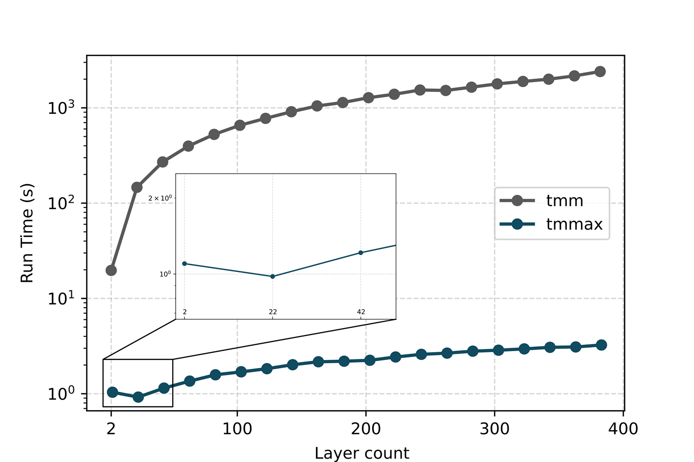
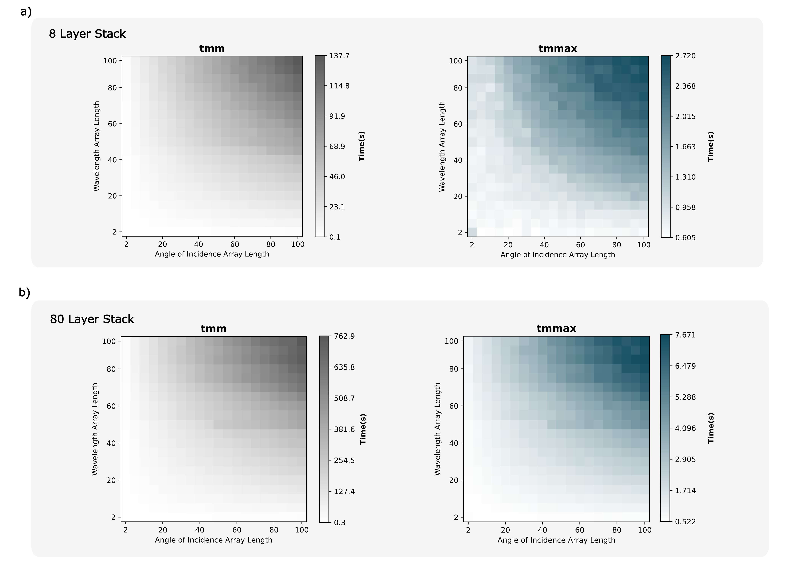

.. role:: tmmgreen

Benchmarks
==========

In multilayer optical thin-film simulations using the TMM, evaluating the runtime under different configurations and analyzing scalability are critical, as the parameters that most significantly affect runtime include the number of layers in the multilayer structure, the length of the wavelength array, and the length of the angle of incidence array. Each of these parameters can substantially increase the computational load. To benchmark the performance of the TMMax library, we used the tmm library developed by Steven Byrnes, which is implemented in Python using the NumPy, as the baseline. In all comparisons, both libraries receive identical inputs; that is, the same layer structure, material parameters, wavelength arrays, and angle arrays, ensuring a direct and fair performance comparison.

   Run time as a function of layer size, shown on a semi-logarithmic scale, comparing the tmm package (orange) with TMMax (blue). While the tmm runtime increases steeply with the number of layers, TMMax exhibits significantly improved scalability, with runtime growing slowly and eventually flattening for large stacks. The inset highlights that TMMax maintains a nearly constant execution time (:math:`$\sim$`1.0–1.2 s) for small layer counts (2, 22, 42). As the number of layers increases, the performance advantage of TMMax becomes more pronounced, reaching a speedup of approximately 18× at 2 layers and up to 700× at 400 layers.

To analyze the effect of increasing the number of layers on computational performance, we sample 20 different multilayer structures ranging from 2-layer to 400-layer. As the number of layers grows, the complexity of the multilayer structure correspondingly increases, impacting the computation time required for the simulation. The material of each layer is assigned by randomly picking from seven materials. The thickness of each individual layer was randomly selected within the range of 100 nm to 500 nm. The spectral domain was sampled with a wavelength array consisting of 20 uniformly spaced points spanning from 500 nm to 1000 nm, covering the visible to near-infrared region. Similarly, the angular domain was discretized with 20 evenly distributed incidence angles ranging from normal incidence (0 radians) up to grazing incidence (:math:`\pi`/2 radians). Throughout the study, these spectral and angular parameters were held constant to systematically analyze the impact of increasing the number of layers on the calculation of optical response. This approach enables a clear assessment of how structural complexity, via layer count, influences computational demand and optical characteristics independently of spectral or angular sampling variations. As shown in Figure 3, the runtime of the tmm increases rapidly as the number of layers increases, whereas TMMax increases much more slowly and exhibits a more scalable behavior. In the inset of Figure 3, the runtime of TMMax remains nearly constant (~1.0 to ~1.2 seconds) for low layer numbers (2, 22, 42). Additionally, as the number of layers increases, the speedup provided by TMMax increases. As can be seen in Figure 3, TMMax achieves approximately an 18-fold speedup for a 2-layer structure, while this acceleration reaches up to 700-fold for 400 layers.

   The colormaps show the runtime performance of the tmm package and TMMax across varying simulation grid sizes, defined by the lengths of the wavelength and angle arrays. For an 8-layer stack (a), tmm's runtime increases significantly with grid size, while TMMax remains consistently faster; for small inputs, tmm shows a slight advantage over TMMax. A more pronounced performance gap appears in the 80-layer stack (b), where TMMax consistently completes simulations in under 8 seconds, while tmm exceeds 760 while tmm exceeds 760 seconds, highlighting the enhanced scalability and efficiency of TMMax in large-scale thin-film simulations.

Another important factor is the lengths of the wavelength and incident angle arrays. To benchmark the effects of these parameters, we perform tests analogous to the layer size benchmark configuration described above. However, this time, keeping the number of layers constant, we sample the sizes of the wavelength and angle arrays at 20 different values ranging from 2 to 100, and for each combination, we create simulation grids ranging from 2×2 to 100×100. In tests conducted for an 8-layer structure (Figure 4a), the runtime of the tmm increases rapidly as the grid size grows, reaching approximately 138 seconds for the 100×100 configuration. In contrast, TMMax exhibits resilience against this increase, remaining below 3 seconds across the entire grid. However, in the 2×2 grid of the two colormaps, we observe that tmm outperforms TMMax. This difference stems from the underlying implementations: tmm is implemented using NumPy, whereas TMMax is built upon JAX. Generally, NumPy achieves faster execution for small input sizes due to its minimal per-operation dispatch overhead, whereas JAX incurs a higher initialization cost that can adversely affect performance in such scenarios. This explains why the tmm code runs around 0.1 seconds and the TMMax code runs approximately 0.6 seconds. As shown in Figure 4b, the performance advantage of TMMax becomes significantly more evident when the number of layers reaches 80. While tmm’s runtime exceeds 760 seconds, TMMax remains below 8 seconds across the entire grid. This demonstrates that TMMax exhibits high efficiency and stability against both problem size and structural complexity.

To ensure the reliability of the comparisons, we use Python’s built-in timeit module. Each simulation repeats 50 times, and the average value is taken; thus, transient systematic effects minimize. The input parameters, including material sequences, layer thicknesses, wavelength values, and angle arrays, are kept the same for both libraries. The comparisons run on a single Intel Core i9 processor core only, without using any GPU or multicore processor, to ensure a fairer comparison.

