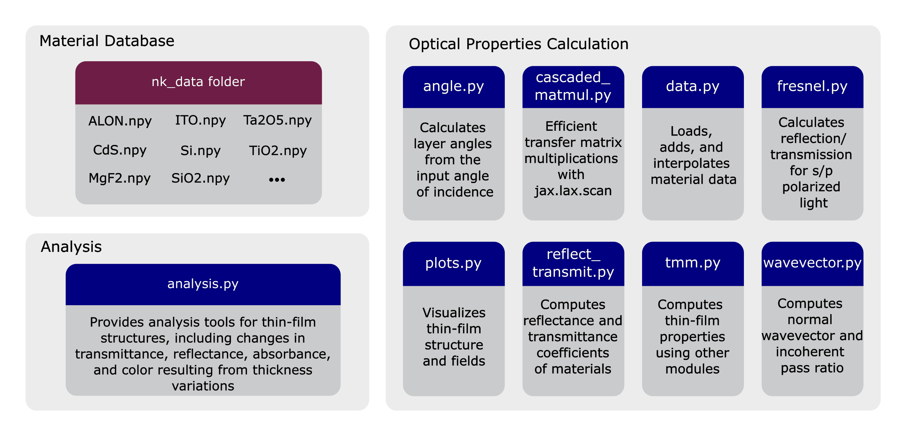

.. role:: tmmgreen

Code Structure
==========

   Modular architecture of TMMax, structured into three main components to facilitate efficient multilayer thin-film simulations. The Material Database (top left) comprises a curated set of .npy files containing refractive index and extinction coefficient data stored in the nk data folder. The Optical Properties Calculation core (right) includes modular scripts for angle calculations, transfer matrix multiplications, Fresnel reflection or transmission, and material interpolation, among others, together performing all intermediate computations essential for the TMM. The Analysis section (bottom left) provides tools to evaluate the optical performance of thin-film stacks, including transmittance, reflectance, absorbance, and resulting color as functions of layer thickness.

We designed TMMax to provide a comprehensive library that enables rapid simulations of multilayer optical thin-films, while also integrating a publicly accessible material database and implementing extensive functionalities to facilitate the evaluation and characterization of thin-film structures. As shown in figure, we structured TMMax into three main components: the nk_data module, which serves as a curated material database; the optical properties computation core, responsible for all intermediate calculations required by the TMM; and the thin-film analysis interface, which enables performance evaluation and characterization of multilayer structures. Since TMMax is written in JAX, these components adhere to functional programming principles. The design does not use classes or object-oriented structures; however, a user who prefers object-oriented design can easily encapsulate TMMax functions within their own classes. 

Material Database
-----------------

Dielectric materials used in thin-film designs are selected from a curated material database that contains refractive index and extinction coefficient data. These two optical data are obtained from the refractiveindex.info database of optical constants, which compiles data from numerous different scientific publications, carefully gathered from validated experimental studies and peer-reviewed publications to ensure optical accuracy across a wide spectral range. In addition, a reference file is available in the docs/database_info folder within TMMax `GitHub repository <https://github.com/bahremsd/tmmax>`_, containing information for each material about the source publication and the measurement methods employed. Each material entry in the database is stored as a matrix in the .npy format with dimensions (3, N), where the first row contains wavelength values, and the second and third rows correspond to the refractive index and extinction coefficient values at those wavelengths, respectively. This storage format allows us to directly load data using JAX without any intermediate conversion, significantly facilitating the data loading process. Moreover, users can easily add new materials to the TMMax database. To support this, a Jupyter notebook in the `examples <https://github.com/bahremsd/tmmax/tree/master/examples>`_ folder provides step-by-step instructions on how to add materials using TMMax’s save_nk_data function. Users who wish to share their own materials can contribute by submitting a pull request to the TMMax GitHub repository.

Optical Properties Calculation
------------------------------

Optical properties of the thin-film, such as transmittance, reflectance, and absorbance, are calculated in this section. As shown in figure, this section contains eight different Python files that enable the implementation of the TMM specifically for coherent and incoherent thin-films. In TMMax, users simulate multilayer optical thin-films exclusively through the core TMM function implemented in the tmm.py module, while all other modules are specifically designed to handle intermediate computational processes required for an accurate and efficient execution of the TMM. To explain them sequentially, we calculate the angle between the light ray and the layer normal in each layer of a thin-film using the functions in angle.py. We use these angles together with the Fresnel equations implemented in fresnel.py within the reflect_transmit.py file to calculate the reflection and transmittance coefficients between layers, considering both s- and p-polarizations. While performing polarization-dependent calculations, conditional statements such as if, which are typically used when running code through the Python interpreter, are avoided. Instead, the jax.lax.cond function is employed to ensure compatibility with JIT compilation. This prevents interpreter-related bottlenecks after transformation and enables efficient, polarization-specific coefficient evaluation within the TMM function. Additionally, functions necessary to compute the normal wavevector, which is required to determine the optical phase accumulation within each layer, and functions to calculate the transmittance and reflectance ratios of thick incoherent layers are located in the wavevector.py file. Ultimately, to combine these and find the system matrix, multiplication of chain matrices is required, and this chain matrix multiplication code is implemented in cascaded_matmul.py using the jax.lax.scan function. In addition to the intermediate steps of TMM, helper functions for data preprocessing and visualization are also essential. The first of these involves loading and interpolating refractive index and extinction coefficient data from the material database, which is implemented in the data.py file. The second involves visualizing the layer-by-layer material structure of the thin-film and observing the distribution of the electric field intensity between layers; these are implemented in the plot.py file.

Analysis
--------

The prediction of reflected color from multilayer optical thin-films under varying illumination conditions, along with the calculation of transmittance and reflectance sensitivities, is implemented within a single-file module. To observe the color of a multilayer thin-film, users can employ the functions within the analysis file, which leverage the Python-based ColorPy library :cite:`kness2008colorpy` to perform accurate physical color calculations. Additionally, during fabrication, unavoidable variations occur from the target thicknesses in one or more layers of the multilayer structure, leading to changes in transmittance, reflectance, and consequently the resulting color of the thin-film. The analysis file implements functions that calculate how percentage deviations from these target thicknesses influence the film’s optical properties, enabling sensitivity analysis for transmittance, reflectance, and color.

References
----------

.. bibliography::
   :cited:
   :style: unsrt