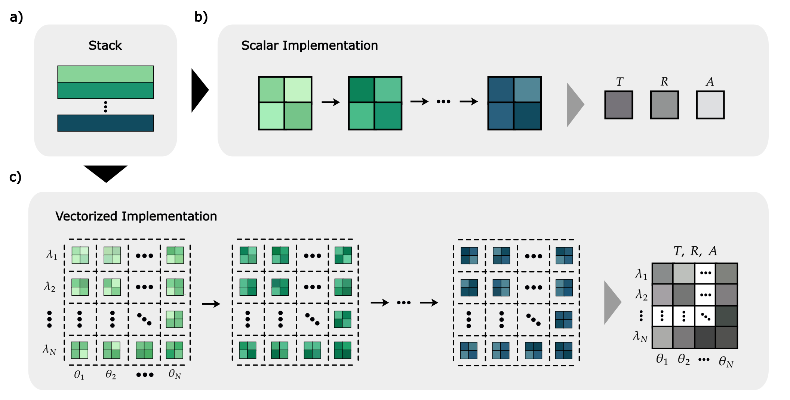

.. role:: tmmgreen  :tmmgreen:`TMMax`

Motivation
==========

Transfer Matrix Method (TMM) is a technique used to model multilayer optical thin-films, where the path of light incident on the film is determined using Snell’s law, and the transmittance and reflectance coefficients at interfaces between different materials are calculated using the Fresnel equations. 

.. math::

   \mathbf{M} = \mathbf{I}_0 \cdot  \prod_{i=1}^{N-2} \mathbf{M}_i

.. math::

   \mathbf{M}_i = \mathbf{I}_i \mathbf{P}_i = 
   \begin{bmatrix}
   \alpha_{i, i+1} & \gamma_{i, i+1} \\
   \gamma_{i, i+1} & \alpha_{i, i+1}
   \end{bmatrix}
   \begin{bmatrix}
   e^{-j \delta_i} & 0 \\
   0 & e^{j \delta_i}
   \end{bmatrix}
   =
   \begin{bmatrix}
   \alpha_{i, i+1} e^{-j \delta_i} & \gamma_{i, i+1} e^{j \delta_i} \\
   \gamma_{i, i+1} e^{-j \delta_i} & \alpha_{i, i+1} e^{j \delta_i}
   \end{bmatrix}

In TMM, the optical behavior of a multilayer structure composed of dielectric materials is obtained by computing the system matrix :math:`\mathbf{M}`, as shown in Equation (1). This matrix calculation, commonly referred to as the Abeles TMM [@refId0], results from the successive multiplication of the transfer matrices of each layer and interface :cite:katsidis2002general as expressed in Equation (2). Each layer is represented as :math:`\mathbf{M}_i = \mathbf{I}_i \mathbf{P}_i`, where :math:`\mathbf{I}_i` denotes the interface matrix and :math:`\mathbf{P}_i` represents the propagation matrix that describes the light propagation through the :math:`i` th layer. The interface matrix :math:`\mathbf{I}_i` contains terms that depend on the reflection and transmission coefficients at the boundary between the :math:`i` th and :math:`(i+1)` th layers.

.. math::

   \alpha_{i, i+1} =
   \begin{cases}
   \dfrac{n_i \cos\theta_i + n_{i+1} \cos\theta_{i+1}}{2 n_i \cos \theta_i} & \text{(s-pol.)} \\
   \dfrac{n_i \cos\theta_{i+1} + n_{i+1} \cos\theta_{i}}{2 n_i \cos \theta_i} & \text{(p-pol.)}
   \end{cases}

.. math::

   \gamma_{i, i+1} =
   \begin{cases}
   \dfrac{n_i \cos\theta_i - n_{i+1} \cos\theta_{i+1}}{2 n_i \cos \theta_i} & \text{(s-pol.)} \\
   \dfrac{n_i \cos\theta_{i+1} - n_{i+1} \cos\theta_{i}}{2 n_i \cos \theta_i} & \text{(p-pol.)}
   \end{cases}

.. math::

   \delta_i = \dfrac{2\pi}{\lambda} n_i d_i \cos \theta_i

As can be seen in Equation (3) and Equation (4), its elements, :math:`\alpha_{i,i+1}` and $, vary depending on the polarization of the incoming light. The propagation matrix :math:`\mathbf{P}_i` characterizes the optical phase accumulated by the electromagnetic wave as it traverses the :math:`i` th layer. As detailed in Equation (5), the accumulated phase :math:`\delta_i` is given by :math:`\delta_i = \frac{2\pi}{\lambda} n_i d_i \cos\theta_i`, where complex-valued :math:`n_i` is the sum of the refractive index and extinction coefficient of the layer, :math:`d_i` is the layer thickness, :math:`\theta_i` is the angle of incidence, and :math:`\lambda` is the wavelength of the incoming light :cite:macleod2010thin . Finally, the elements of the resulting system matrix :math:`\mathbf{M}` yield the reflection and transmission properties of the optical coating formed by the stack of layers :cite:harbecke1986coherent . The TMM relies fundamentally on matrix–matrix multiplications and linear transformations, both of which are computationally efficient operations :cite:10.1117/12.862566 . Owing to the inherently structured nature of these calculations :cite:Santbergen:13 , the overall simulation workflow benefits substantially from hardware-level acceleration via vectorization and parallelization. This makes TMM particularly well suited for high-throughput modeling :cite:Centurioni:05 and optimization of multilayer optical coatings, where rapid evaluation across a wide parameter space is essential :cite:shi2017optimization . However, in currently implemented TMM packages :cite:byrnes2020multilayeropticalcalculations :cite:Dmitriev2017PyTMM :cite:Dominec2017TransferMatrixMethod, the angle of incidence and wavelength of the incoming light are typically treated as scalar inputs, rather than as vectorized parameters. 

   Schematic representation of two implementation strategies for calculating transmission, reflection, and absorption in multilayer thin-film simulations. A multilayer system composed of stacked layers (a) is modeled by traditionally computing the optical response sequentially through multiplication of a chain of 2×2 transfer matrices for each wavelength and angle of incidence (b). In contrast, the vectorized approach (c) performs the same computation by vectorizing the operations along both the wavelength and angle-of-incidence axes.

The simulation of the stack of layers, as shown in Figure 1a, is performed by taking only a single wavelength and angle of incidence value, as illustrated in Figure 1b, and consequently, in an traditional TMM implementation, a single function call returns transmittance, reflectance, and absorbance for only one wavelength and one angle of incidence. In scalar implementations of the TMM, two nested loops are typically employed to simulate the optical response of thin-films over arrays of wavelengths and angles of incidence :cite:byrnes2020multilayeropticalcalculations . In addition to this, redundant computations frequently arise. For example, when investigating the optical characteristics of a thin-film at multiple angles of incidence for a fixed wavelength, the wavelength-dependent component of the wavevector along the propagation direction, :math:`k_z`, is recalculated. This approach is highly inefficient, as these redundant recalculations significantly increase computational cost without improving accuracy. To eliminate these redundant calculations, wavelength and angle of incidence should be considered as vectors rather than scalars, and by performing vectorization, the two nested for loops can be eliminated. In TMMax, we vectorize wavelength and angle of incidence using the JAX library :cite:jax2018github . As seen in the schematic of the vectorized implementation in Figure 1c, we vectorize all intermediate operations in TMM and subsequently apply the JAX’s just-in-time (JIT) decorator. Instead of running the mapped TMM code sequentially over each batch element of wavelength and angle of incidence, jax.jit fuses all operations across the batch into a single XLA-compiled :cite:xla2023github kernel. This reduces function call overhead and provides a faster TMM implementation.

The chain of matrices is multiplied using a for loop to obtain the overall system matrix in the TMM, as expressed in Equation (1). However, the for loop inherently involves carry-over dependencies that limit computational efficiency in calculating the system matrix; fortunately, more advanced computational strategies can be used to mitigate such inefficiencies :cite:6131837 . In TMMax, we eliminate this carry-over for loop by employing the scan function within the lax module of the JAX. The lax module is a Python wrapper that enables the execution of primitives written in XLA within Python. In this way, we achieve a faster TMM by removing the for loop from the code, vectorizing the computations, applying JIT compilation transformations, and thus preventing the TMM from entering the for loop, thereby avoiding interpreter bottlenecks. Moreover, most of the implemented TMM libraries operate on CPUs and the computation of the system matrix over a specified wavelength and angle of incidence range typically relies on sequential for loops, which iterate across the spectral and angular domains to evaluate transmittance and reflectance. This inherently limits computational efficiency due to the serial nature of the execution. While this sequential execution remains efficient for thin-films with a limited number of layers, its performance degrades considerably as the layer count increases. For example, simulating a 100-layer structure becomes computationally intensive due to backend bottlenecks, where the prolonged runtime of for loops leads to significant processing delays. However, these delays can be effectively mitigated in TMM because calculations for different angles of incidence and wavelengths are inherently parallelizable and non-recursive. Therefore, TMM is inherently suitable for parallelization and can run on platforms such as GPUs and TPUs. For this reason, we implement TMMax with the JAX, thereby obtaining a backend-agnostic TMM. In other words, we enable TMMax to run seamlessly on CPUs, GPUs and TPUs without any code modification. Additionally, we facilitate deep learning–based inverse design involving TMM by performing all calculations on the GPU, eliminating the need for data transfer back to the CPU :cite:10.1117/1.OE.58.6.065103 .

Automatic differentiation holds a crucial role in optimization problems because it computes derivatives required for optimization both accurately and efficiently, unlike finite difference methods which approximate derivatives and can suffer from truncation and round-off errors :cite:baydin2018automatic . This approximation arises because finite differences estimate derivatives by evaluating small perturbations in parameters, which inherently limits precision. In the design process of systems such as multilayer thin-films, minimizing the loss function over physical parameters (thickness, refractive index, etc.) is necessary :cite:Luce:22, and gradients play a critical role at this stage. Conventional TMM implementations are written using libraries like NumPy :cite:2020NumPy-Array that do not natively support automatic differentiation. For example, if automatic differentiation is desired in such NumPy-based implementations, an additional library such as Autograd :cite:maclaurin2015autograd must be used, which increases the implementation complexity of the code. TMMax, however, is designed according to the functional programming principles with JAX, enabling effortless gradient computation. Furthermore, TMMax can be integrated with the Optax library :cite:deepmind2020jax , a gradient processing and optimization library built on JAX that offers a wide range of optimization functions and procedures. This integration enables direct computation of derivatives with respect to thin-film parameters, such as layer thicknesses and material properties, thereby facilitating efficient gradient-based inverse design. As a result, these gradients can be utilized by advanced optimization algorithms, such as L-BFGS :cite:liu1989limited and Adam :cite:kingma2017adammethodstochasticoptimization , to rapidly converge toward optimal thin-film configurations. Consequently, layered structures can be rapidly designed to achieve targets such as optical reflectivity or transmittance.

The majority of implemented TMM packages focus exclusively on the calculation of the system matrix :cite:Luce:22 :cite:leandro_acquaroli_2022_6479354 . However, these libraries generally lack a material database or offer only limited material data. This deficiency requires users to manually add their own refractive index and extinction coefficient data, which is both time-consuming and prone to errors. Furthermore, the accuracy of calculations performed with TMM directly depends on the reliability of the refractive index and extinction coefficient data used; if the material data is inaccurate, the simulation deviates from the experimentally obtained optical response. Therefore, in TMMax, we integrate a database of 30 widely used materials for multilayer optical thin-film fabrication. These materials are selected based on commonly used ones referenced in the reference book Thin-Film Optical Filters by H. Angus Macleod :cite:macleod2010thin . The refractive index data were carefully gathered from refractiveindex.info :cite:polyanskiy2024refractiveindex , a trusted online database that collects optical properties from many scientific papers and verifies each entry against the original sources to ensure accuracy and reliability.The source of the material information for each study is documented in the “README.md” file located in the “docs/database_info” folder of the library, and we designed the TMMax material database as a dynamic, living ecosystem. To facilitate collaborative growth, we implemented user-friendly helper functions that support the straightforward addition of refractive index and extinction coefficient data from external laboratories into the TMMax database. By contributing data through these tools and submitting pull requests to the TMMax `GitHub repository <https://github.com/bahremsd/tmmax>`_, we foster a community-driven platform that continually expands and enriches shared material knowledge for the thin-film coating community.

References
==========

.. bibliography::
   :cited:
   :style: unsrt
